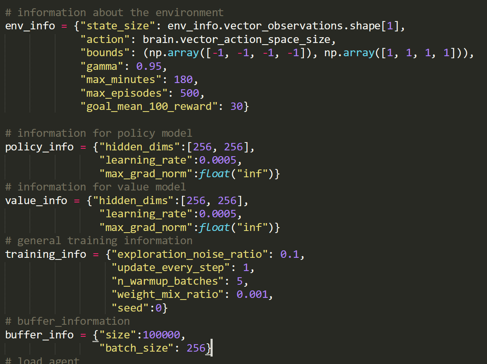
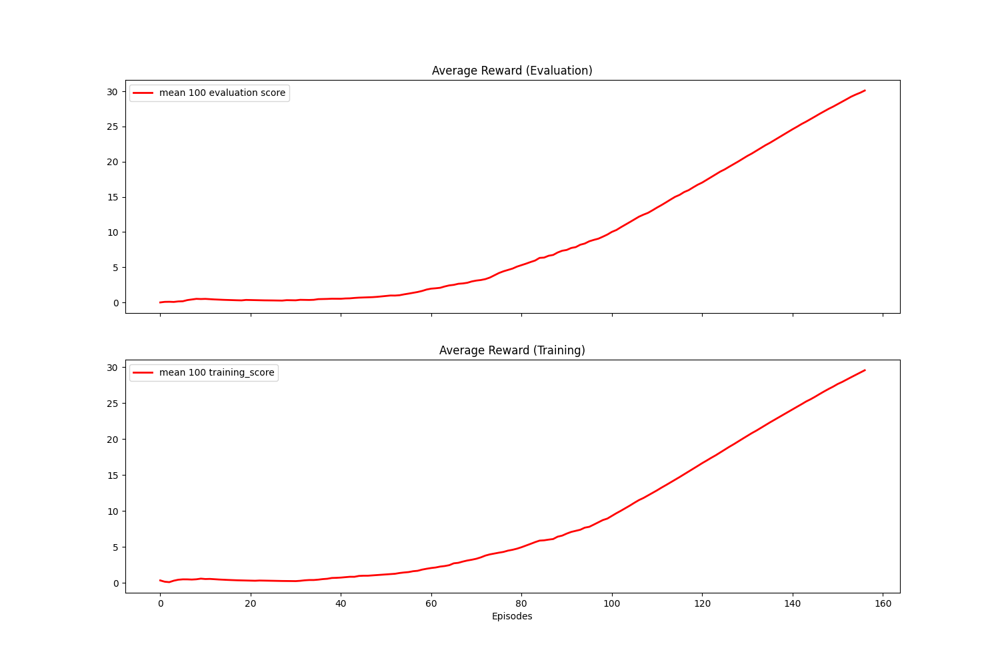

[//]: # (Image References)

[image1]: https://user-images.githubusercontent.com/10624937/43851024-320ba930-9aff-11e8-8493-ee547c6af349.gif "Trained Agent"

# Continuous Control Report

### Introduction

For this project, I chose to work with the single agent [Reacher](https://github.com/Unity-Technologies/ml-agents/blob/master/docs/Learning-Environment-Examples.md#reacher) environment. 

![Trained Agent][image1]

In this environment, a double-jointed arm can move to target locations. A reward of +0.1 is provided for each step that the agent's hand is in the goal location. The goal of your agent is to maintain its position at the target location for as many time steps as possible. In this case 100 episodes. 

The observation space consists of 33 variables corresponding to position, rotation, velocity, and angular velocities of the arm. Each action is a vector with four numbers, corresponding to torque applicable to two joints. The actions in this environment are bounded between -1 and 1. The task is episodic, and in order to solve the environment,  your agent must get an average score of +30 over 100 consecutive episodes.

### Solving the Environment
For this project I chose the Deep Deterministic Policy Gradient [DDPG] which is a modification on Deep Q-Learning for continuous environments. Two tests were run:
    1. In the first case we randomly sample the experience buffer
    2. DDPG with prioritized experience replay.
DDPG was chosen because of simplicity as I was familiar with the Deep Q-Learning network. One twist was the addition of noise during training to make the model more robust. 

#### Network Parameters
The actor and critic networks use two hidden layers making it a 4-layered network. Each layer has 256 nodes and uses relu activation. The output of the action layers are tanh activation and then rescaled to environment bounds. To encourage exploration and for additional robustness we add gaussian noise to the actions with an exploration ratio of 0.1. Following tuning the network parameters settled on are:

The parameters are held constant for the randomly sampled buffer and the prioritiy sampled buffer.

### Results
For the test with random sampling the results are shown in the table and photo below:

| Total Episodes | Time taken | Training Score | Evaluation Score |
| -------------  | ------------- | ------------- | ------------- |
| 133   | 00:48:18  | 37.2±3.3  | 36.8±3.7  |

### Instructions

Follow the instructions in `Continuous_Control.ipynb` to get started with training your own agent!  

